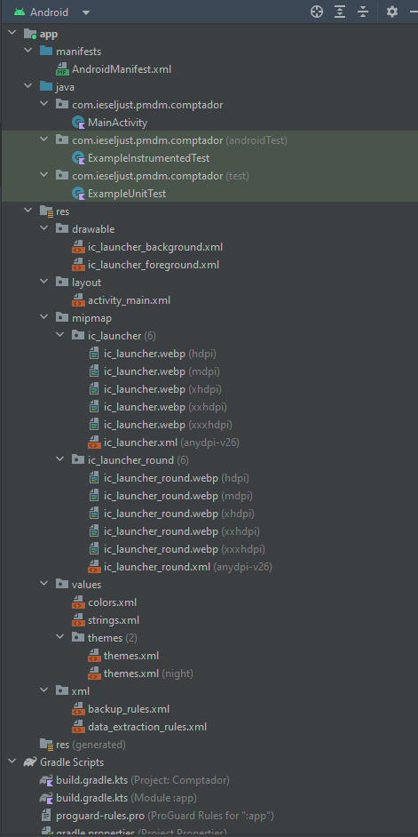
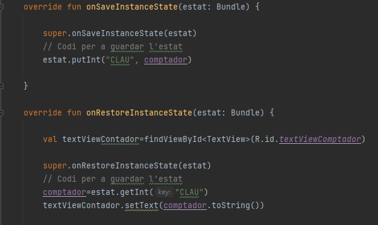
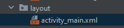
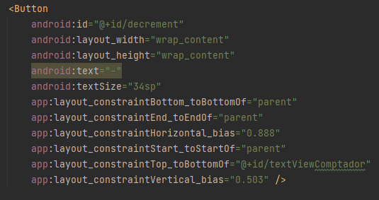
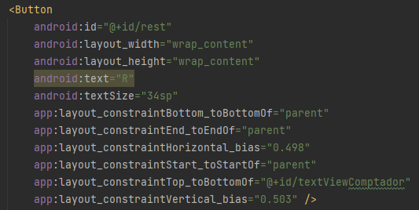
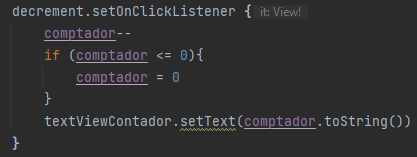
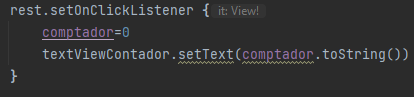

### Documentació Projecte

### 1. Anàlisi de l'estructura del projecte:

Aquest projecte consisteix en realizar una aplicacioneta la qual conté un comptador. L'objectiu es crear tres botons, un que augmente el comptador, un que el decremente i altre que el restaure a 0. Per altre costat, tenim que evitar que al moment de girar la pantalla el comptador torne a 0.

L'estructura es basa en la típica d'un projecte Gradle. Conté fitxers generals de l'aplicació en carpeta arrel, la qual també conté la carpeta pròpia del mòdul d'aplicació app. A Android, es presenta una perspectiva organitzada en carpetes lògiques: manifests, java, res i Gradle Scripts

Les més importants son:

* Scripts Gradle de construcció del projecte en format Kotlin DSL, que conté l'informació comuna de tots els mòduls, com el propi mòdul de l'aplicació.

* En la carpeta **app**, es troba la carpeta *src*, que conté el codi font de l'aplicació. En vista Android, es troba en la carpeta java en format de nom de paquet.

* Carpeta app/src/res, que contindrà els recursos de l'aplicació. Conté subcarpetes per als diferents recursos. En vista Android, es mostra de forma més compacta i organitzada.

* Fitxer descriptor d'aplicació: *app/AndroidManifest.xml*. Es tracta dels fitxers més importants del projecte. Definix el nom, el paquet, la icona i els components.

### 2. Anàlisi del cicle de vida de vida i el problema de la pèrdua d'estat:

En l'aplicació, s'observa que el comptador es reinica cada vegada que es gira la pantalla del mòbil, aleshores l'objectiu es evitar que açò passe. Per tant, he trobat les dos funcions que, si les implementem i modifiquem, ens poden ajudar a resoldre aquest conflicte, que son les nomenades *onSaveInstanceState* i *onRestoreInstanceState*. La primera ens serveix per a guardar el valor actual de la variable, i la segona ens servirà per a mostrar el estat actual de la mateixa.

### 3. Solució a la pèrdua d'estat:

Per a solucionar la pèrdua d'estat, el que he fet ha segut implementar en la classe Activity, els mètodes abans nomenats en el punt anterior. El primer, *onSaveInstanceState*, l'he implementat per a guardar el valor de la variable, però en la segona, al moment d'implementar-la, ens trobabem en la situació de que si giraves la pantalla, tornava al cero, però si li apretaves al botó "+", eixía el últim valor que s'havia guardat abans de girar la pantalla. Per a solucionar aquest error, he agafat la referència *val textViewContador* per a inicialitzar-la en el mètode, i després he mostrat per pantalla l'estat actual del comptador amb "textViewContador.setText(comptador.toString())"

### 4. Ampliant la funcionalitat amb decrements i resets:

En el fitxer *activity_main.xml*, situat en la carpeta *layout*, he creat dos botons amb les funcionalitats requerides en la pràctica. Aquests tenen les funcions de restablir el comptador a 0 i l'altre disminuir el comptador.
Per a que mostre un signe de "-" (en cas de disminuir) i una "R" (en cas de restablir), anem a l'apartat de *android:text* i sustituir el valor per els nomenats. També en el meu cas en el apartat *android:id* he modificat el nom per a posar el seu corresponent.

Així es veuen:

Una vegada fet açò en l'arxiu *activity_main*, anem a la classe *MainActivity* i invoquem als botons creats amb l'extensió *setOnClickListener* per a que realitze l'efecte dessitjat. Dins de cada apartat, posarem les condicions per a que el botó realitze el seu propòsit. En el cas del botó per a disminuir, també he anyadit una condició per a que, en cas de disminuir a partir de 0, no ixquen números negatius. Així es com quedaría: 

### 5. Aplica El View Binding:

1. Activar el ViewBinding a les buildFeatures de l’script Gradle del mòdul.

2. Sincronitzar el projecte amb aquest script, per a que genere les classes de vinculació.

3. Importar la classe de vinculació en el fitxer de la classe on l’anem a utilitzar.

4. Declarar l’objecte (binding) que accedirà a aquesta classe (generalment com a lateinit) i definir-lo mitjançant l’unflat de la vista.

